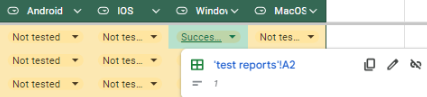
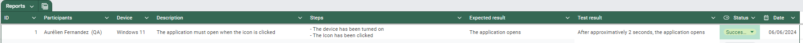

<h1 align="center"> Test plan </h1>

<p align="center"> 
Created by: Aurélien FERNANDEZ <br> Creation Date: 21/05/2024 <br> Last update: 06/06/2024
</p>

___

<details>

<summary>Table of content</summary>

- [1. Product analysis](#1-product-analysis)
  - [1.1 Overview](#11-overview)
- [2 Strategy](#2-strategy)
  - [2.1 Scopes](#21-scopes)
    - [2.1.1 In scope](#211-in-scope)
    - [2.1.2 Out of scope](#212-out-of-scope)
  - [2.2 Unit Tests](#22-unit-tests)
  - [2.3 Test list](#23-test-list)
    - [2.3.1 Must features](#231-must-features)
    - [2.3.2 Should features](#232-should-features)
  - [2.4 Test sessions](#24-test-sessions)
    - [2.4.1 Smoke testing](#241-smoke-testing)
    - [2.4.2 Beta testing](#242-beta-testing)
  - [2.5 Tools](#25-tools)
    - [2.5.1 Github issues](#251-github-issues)
    - [2.5.2 Google sheet](#252-google-sheet)
- [Glossary](#glossary)


</details>

## 1. Product analysis

### 1.1 Overview

This project, given by we are evolution[^1], aims to create a job dating platform inspired by popular apps similar to Tinder to permit people searching for a job to get a job interview in a short time with low effort. 

To avoid any form of discrimination, all candidates shall remain anonymous[^2]. Candidate profiles will only include soft skills[^3] and additional information provided by the candidates, encouraging recruiters to focus on these aspects. Hard skills will not be displayed, as the app is designed for temporary or low-requirement jobs.
   
## 2 Strategy

For this project, the main strategy regarding testing will be manual testing[^4], as this project is mainly graphical. 

The first tests will include Unit testing to make sure crucial functions such as the multiple pages functionalities, maps, AIs, the voting system and more. All features can be found in the [functional specifications](../functional_specifications.md) document.

### 2.1 Scopes 

The tests performed during this project will be focused on the graphical interface and the multiple functions needed for the app to function properly. However, features such as a fully operational backend[^5] are not going to be heavily tested as it is not a scope of the project.

#### 2.1.1 In scope

- Program
  - No major bug impacting the user experience[^6]
  - Features requested by the client are present
  - A user interface[^7] accepted by the client
- Documents
  - The documents should not contain any typographical or grammatical errors
  - The documents should be accurate according to the current project

#### 2.1.2 Out of scope

- Features not requested by the client
- Backend

### 2.2 Unit Tests

Unit tests[^8] are one of the most important types of tests. They are created preferably before their related functions or at the same time. 

The multiple unit tests are written in flutter[^9] mirroring to the rest of the project.

The aim of these unit tests is to:
 - Ensure code quality: To create an environment where maintainability and readability are not a problem for future developers
 - Code effectiveness: To make sure that each function is working as expected |

### 2.3 Test list

Multiple features are desired for the accomplishment of this project. The following features are considered as the features to be tested at the highest priority after each modification of the application.

#### 2.3.1 Must features

| Function                           | Expected result                                                                                                        |
| ---------------------------------- | ---------------------------------------------------------------------------------------------------------------------- |
| Open the app                       | The app must open when tapping on the icon                                                                             |
| Create an account                  | A user must be able to create an account and configure it.<br>Either as a candidate or a recruiter                     |
| Authenticate                       | A user must be able to authenticate.<br>Either as a candidate or a recruiter                                           |
| Notifications                      | Candidates and recruiters must be able to receive notifications from new job offers or matches                         |
| Modify settings                    | A user must be able to modify the app's settings and keep the changes after closing the app                            |
| Filtering                          | A recruiter/candidate must be able to filter candidates/companies.<br>Either by locations, name, etc                   |
| Match                              | A recruiter/candidate must be able to match with a candidate/company by swiping to the right                           |
| Refuse                             | A recruiter/candidate must be able to  match refuse a candidate/job offer by swiping to the left                       |
| See details                        | A recruiter/candidate must be able to see a candidate's/recruiter's details                                            |
| Company/candidate insights         | A recruiter or candidate must be able to create their own personalised description to attract new candidates/companies |
| Professional development resources | Courses can be watched by candidate to improve their score                                                             |
| AI interview                       | A candidate must be able to be interviewed by an AI[^10], the result of the interview is a text sent to the recruiter   |
| Anonymous                          | All candidates must remain anonymous.                                                                                  |

#### 2.3.2 Should features
| Function                         | Expected result                                                                                                                                       |
| -------------------------------- | ----------------------------------------------------------------------------------------------------------------------------------------------------- |
| Candidate Persona Development    | A candidate may be able to add their evolution in their professional life (e.g: started as a customer service employee to developer with given dates) |
| AI-powered description generator | An AI may be used by users  to generate their description                                                                                             |

### 2.4 Test sessions

Due to the project's goal to create a mockup application[^11], automated tests are not suited for this project. Therefore manual tests[^4] are the most suited tests. Moreover, to ensure a high-quality and user-friendly[^12] product, both [smoke testing](#241-smoke-testing)[^13] and [beta testing](#241-beta-testing)[^14] will be performed.

Apart from unit tests[^8], which will be created alongside the code, and documentation review, tests will be performed after each push[^15] into the main branch or release.

Regular tests will happen on the dev branch to ensure the quality of the code.

#### 2.4.1 Smoke testing

A session of smoke testing will be composed of a tester, who is in most cases the QA[^16] of the team, a computer, either a MacOS or a Lenovo computer running Windows 11 provided by ALGOSUP and at least one mobile phone, either Android or IOS.

<h5>Scopes</h5>

The scopes of smoke testing are the following:

- **App launch**: Ensure the app can launch without critical errors or crashes.
- **Login**: Ensure the user can log in either as a candidate or recruiter and redirect to the corresponding pages.
- **Interactions**: Ensure the user can interact with the app, by navigating through the different pages or modifying content. Visual or audio feedback is expected for each interaction.
- **Matching system**: Ensure the matching system is correctly working and allows the candidate and the recruiter to communicate and set up a date for an interview.
- **Account management**: Ensure users can manage their account: create, edit, log in/out, delete or even ask for logs[^17].

<h5>Procedure</h5>

The smoke testing[^13] sessions will follow these precise steps:

- **Download**: Download the latest release, main or dev version.
- **Test**: Test the cases defined in the "[Test cases](https://docs.google.com/spreadsheets/d/120rxgt8Hd9536cIEwhTwKL6HWTVtzE1JTABL5F2K55A/edit?usp=sharing)" sheet. Tests that have already been tested shall be tested again to ensure no errors break the previously working part of the code. Once a feature has been tested more than one time, only the date and the status of the last test shall be modified to avoid repetitive lines in the table.
- **Report**: Report the results of the multiple tests in this [Google sheet](https://docs.google.com/spreadsheets/d/120rxgt8Hd9536cIEwhTwKL6HWTVtzE1JTABL5F2K55A/edit?hl=fr#gid=1501642177&range=B:B) and create an issue for each bug[^17] found during the tests.

#### 2.4.2 Beta testing

A session of beta testing[^14] will be composed of a user, picked either from or outside of ALGOSUP, and the QA[^16] of the team. The device used for testing the project will be chosen by the user, regardless of the team members' devices used until this moment.

<h5>Scopes</h5>

Along with the previous scopes mentioned in [smoke testing](#241-smoke-testing), the scopes of the beta testing are the following:

- **User interface**: Ensure the interface is simple enough to be understood without external help.
- **Feedback**: Retrieve feedback from end users.

<h5>Procedure</h5>

The beta testing[^14] sessions will follow these precise steps:

- **User**: Find a user, either picked randomly on the spot or selected previously, with their consent. The project must be explained to the user as to: what is the project, its goal and in what circumstance the app is planned to be used.
- **Choose a device**: Ask the user which device they would prefer using, it can be a mobile phone (Android or IOS) or a computer.
- **Download**: Download the application either from Github, the Apple App Store or Google Play, depending on the chosen device and the current availability of the application.
- **Test**: Let the user create an account or log in to a test account and use the app. The user should use the app without advice or instructions given by the QA[^16].
- **Report**: Report the multiple data that can be retrieved from the test in this [Google sheet](https://docs.google.com/spreadsheets/d/120rxgt8Hd9536cIEwhTwKL6HWTVtzE1JTABL5F2K55A/edit?hl=fr#gid=1501642177&range=B:B):
  - The duration of the test,
  - The user journey[^18],
  - The multiple feedback throughout the whole test.
- **Issue reports**: If necessary create an issue about a bug[^17] encountered during the test.

As previously mentioned, user consent is of utmost importance during this test. Users may decline to participate or withdraw at any time if they choose to do so.

### 2.5 Tools

#### 2.5.1 Github issues

As we are using GitHub to work on the current project we can use it to archive the multiple bug[^17] reports and access them freely to read or update them at any given point. 

One of the features we can use with the GitHub issues[^19] is the use of templates. This feature allows us to standardise the flow of information. Finally, each issue is assigned to the person responsible for fixing the issue.

Here are the two different templates for this project:

A template when bugs[^16] are found:


A template if a document has a typographical error, or cannot be understood correctly:


<h3>Examples</h3>

<h4>Bugs issues's template</h4>

<h5>Expected behavior</h5>

  ``` 
  When the icon of the application is tapped, it should open the application.
  ```
<h5>Current behavior</h5>

  ``` 
  When the icon of the application is tapped, only a white screen appears and the application closes itself approximatively 5 seconds after the start.
  ```
<h5>Steps to reproduce</h5>

  ``` 
  - Download the application on an Android phone.
  - When installed, try opening the app by tapping on the icon.
  - Wait a few seconds
  ```
<h5>Screenshot</h5>

  *To add an image, just drag & drop[^20] the image on the input field*
  ``` 
  None
  ```
<h5>Test environment</h5>

  ``` 
  Android phone v14.0
  ```
<h5>Additional context/description</h5>

  ``` 
  None
  ```
<h5>Possible implementation</h5>

  ``` 
  None
  ```

<h4>Documents issues' template</h4>


Documents' issues[^19] have to be written in this specific way:

  <h5>Typographical mistakes</h5>

  ``` 
  - line 00: there is a typographical **mistak**
  ```

  <h5>Corrections</h5>

  ``` 
  -[] line 00: there is a typographical **mistake**
  ```
  <h5>Suggestions</h5>

  ```
  - line 10: the sentence is strangely worded
  ```

Here is an example of how document templates should be written:


Here is a preview of the example:


<h3>Tags</h3>

The issues also come with tags, tags are used to sort and quickly identify in what category a bug[^17] is contained, we currently have two major tags:

- Documents
- Bugs

The bugs[^17] contain a second set of tags which determine the priority:
- High
- Medium
- Low

#### 2.5.2 Google sheet
 
The [test cases](https://docs.google.com/spreadsheets/d/120rxgt8Hd9536cIEwhTwKL6HWTVtzE1JTABL5F2K55A/edit?usp=sharing) and [test reports](https://docs.google.com/spreadsheets/d/120rxgt8Hd9536cIEwhTwKL6HWTVtzE1JTABL5F2K55A/edit?hl=fr#gid=1501642177&range=B:B) are pages of a Google sheet allowing the QA[^16] of the team to archive every test case performed in previous sessions.

<h4>test cases</h4>

**Structure**

- ID: A unique number starting from 1.
- Name: The name of each test case.
- Description: A short description of the test case.
- Steps: Steps to proceed with the test.
- Expected behavior: The behavior expected.
- Android/IOS/Windows/MacOS: The current status of the test is either Not tested, Failed or Successful on a specific operating system.

**Example**


<h4>Reports</h4>


**Test cases links**

Each status, if failed or successful, can redirect to the corresponding test report which is on the second page, "test reports".



**Structure**

- ID: An ID starting from 1.
- Participants: The number of participants and their roles
- Device: Specify the device used, including the model and operating system version. If the specific model and version are unknown, provide the operating system.
- Description: A short description of the test.
- Steps: How the test has been performed. Each action that could impact the result of the test must be included.
- Expected result: the result that is expected at the end of the test.
- Test result: The result at the end of the test.
- Status: A status which is either: Failed or Successful.
- Date: The date on which the test was performed, written in this format DD/MM//YYYY.

**Example**



## Glossary

[^1]: **we are evolution**: A company based in France, aiming to create relations between job-seekers and companies. They are doing so by training teams, creating advertisement campaigns and similarly to our project, creating an application or website to find employees.

[^2]: **Anonymity of Candidates**: The principle of anonymity is the ability to navigate without disclosing any information that may indicate the identity of a person.

[^3]: **Soft skills**: Soft skills are non-technical skills that describe how you work and interact with others.

[^4]: **Manual Testing**: The testing method that involves human interaction, analysis, and evaluation of software without automation.

[^5]: **Backend**: The server-side part of the application, which is not directly visible to the user but handles the application logic and data processing.

[^6]: **User experience**: User experience (UX) refers to the overall experience that a person has when interacting with a product, service, or system

[^7]: **User Interface (UI)**: The graphical layout of an application, including buttons, screens, and visual elements with which a user interacts.

[^8]: **Unit Tests**: The testing method where individual units or components of the software are tested to validate that each unit works as designed.

[^9]: **Flutter**: An open-source UI software development kit created by Google for building natively compiled applications for mobile, web, and desktop from a single codebase.

[^10]: **AI (Artificial Intelligence)**: The simulation of human intelligence processes by machines, especially computer systems, for tasks such as learning, reasoning, and self-correction.

[^11]: **Mockup Application**: A prototype or simulation of an application that demonstrates its functionality and user interface design but may not have full backend functionality.

[^12]: **User-Friendly**: A term used to describe software, interfaces, or systems that are easy to use and understand.

[^13]: **Smoke Testing**: A type of software testing that verifies the basic functionalities of an application without performing exhaustive tests.

[^14]: **Beta Testing**: The stage of software testing where a limited number of end-users evaluate the product in a real-world environment before the final release.

[^15]: **Push**: The principle of push is to send changes to a Git repository, in this project, the repository is stored by Github.

[^16]: **QA (Quality Assurance)**: The process of ensuring that the software meets specified requirements and quality standards.

[^17]: **Logs**: Records of events that happen in an application, which can be used for debugging, troubleshooting, and analysis.

[^18]: **User Journey**: The series of steps that a user takes to accomplish a particular task within an application.

[^19]: **Issues**: A GitHub issue is a feature on the GitHub platform that enables users to track bugs, tasks, or enhancements for software projects.

[^20]: **Drag & Drop**: A method of interacting with digital objects by clicking and dragging them to a different location.

