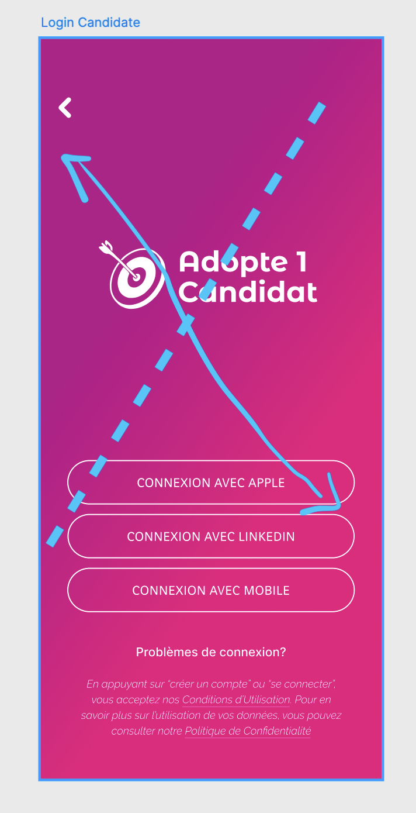

# 2023-2024 - PROJECT 5 - "ADOPTE UN CANDIDAT" APPLICATION - TEAM 4

## Technical Specifications


<details>
<summary>📖 Table of content</summary>

- [2023-2024 - PROJECT 5 - "ADOPTE UN CANDIDAT" APPLICATION - TEAM 4](#2023-2024---project-5---adopte-un-candidat-application---team-4)
  - [Technical Specifications](#technical-specifications)
    - [I. Introduction of the project](#i-introduction-of-the-project)
      - [A. Client](#a-client)
      - [B. Goal of the project](#b-goal-of-the-project)
    - [II. Solution](#ii-solution)
      - [A. Descritpion](#a-descritpion)
      - [B. Operating environment](#b-operating-environment)
      - [C. Features](#c-features)
        - [1. General](#1-general)
          - [a. Swipe-based gesture](#a-swipe-based-gesture)
          - [b. Skill-based job matching](#b-skill-based-job-matching)
          - [c. Interview by AI](#c-interview-by-ai)
          - [d. Job Alerts and Notifications](#d-job-alerts-and-notifications)
          - [e. Job Posting Distribution Tools](#e-job-posting-distribution-tools)
        - [2. Jobseeker](#2-jobseeker)
          - [a. Confidential Candidate Management](#a-confidential-candidate-management)
          - [b. Professional Development Resources](#b-professional-development-resources)
          - [c. Exclusive Job Boards](#c-exclusive-job-boards)
          - [d. Networking and Referral Systems](#d-networking-and-referral-systems)
          - [e. AI-Powered Resume Builder and Templates](#e-ai-powered-resume-builder-and-templates)
        - [3. Recruiter](#3-recruiter)
          - [a. Company Insights and Leadership](#a-company-insights-and-leadership)
          - [b. AI-Powered Job Description Generator](#b-ai-powered-job-description-generator)
          - [c. Candidate Persona Development](#c-candidate-persona-development)
          - [d. Executive Search Tools](#d-executive-search-tools)
      - [D. Contraints](#d-contraints)
      - [E. Risks and assumptions](#e-risks-and-assumptions)
    - [III. Technical Specifications](#iii-technical-specifications)
      - [A. Graphic convention](#a-graphic-convention)
      - [B. Writing convention](#b-writing-convention)
      - [C. File architecture](#c-file-architecture)
      - [D. Implementation](#d-implementation)
    - [IV. Further considerations](#iv-further-considerations)
      - [A. Cost estimate](#a-cost-estimate)
      - [B. Performance](#b-performance)
      - [C. Security](#c-security)
        - [1. Personal Data Protection](#1-personal-data-protection)
        - [2. Transparency](#2-transparency)
        - [3. Non-Discrimination](#3-non-discrimination)
        - [4. Fair Access to Employment](#4-fair-access-to-employment)
        - [5. Consent and Right to be Forgotten](#5-consent-and-right-to-be-forgotten)
        - [6. Data Security](#6-data-security)
        - [7. Contractual Obligations](#7-contractual-obligations)
        - [8. Localization and Internationalization](#8-localization-and-internationalization)
      - [D. Accessibility](#d-accessibility)
    - [V. Success evaluation](#v-success-evaluation)
    - [Project role distribution](#project-role-distribution)
    - [Glossary](#glossary)

</details>


| | |
| - | - |
| Author(s) | Grégory PAGNOUX (Technical Leader) |
| Reviewer(s) | Victor LEROY (Project Manager) |
| Created on | 05/15/2024 |
| Last updated | 05/16/2024 |
|  |  |


### I. Introduction of the project

#### A. Client

[We Are Evolution](https://www.we-are-evolution.com) is a company specialized in the management and business advices since 2019. They help companies to recruit with original tools to meet the challenges of Human Resources.

#### B. Goal of the project

Adopte Un Candidat is a « Tinder style » recruitment application that matches companies with jobseekers in a different way.
The concept is to promote fair recruitment by anonymizing candidates and companies, promoting soft skills[^1], emphasizing the human aspect of the process and facilitating connections between candidates and companies via a dedicated application.

### II. Solution

#### A. Descritpion

The key points of the Adopte un Candidat concept are as follows:

- To avoid discrimination in hiring, candidates and companies are anonymized on the platform. This allows us to focus on candidates' skills and potential, rather than their origin, gender, age, etc.
- Instead of focusing only on diplomas and professional experience, the concept emphasizes  soft  skills,  i.e.  the  behavioral  and  relational  skills  of  candidates.  This  makes it possible  to  recognize  and  evaluate skills such as communication, teamwork, creativity, problem-solving[^2], etc.
- The concept emphasizes the human aspect of recruitment, recognizing that each candidate has unique talents and skills to offer. It seeks to give each individual the opportunity to showcase his or her skills, regardless of background or academic credentials.
- The "matching" process enables candidates and companies to connect and find an ideal match. Candidates can express their preferences in terms of companies and positions, and companies can search for candidates who match their cultural and organizational needs.
- The entire recruitment process takes place on a dedicated application. This facilitates interaction between candidates and companies, offering features such as messaging, personalized profiles, etc.
- In our approach, we don't have tests, quizzes, or games. Instead, candidates will have the opportunity to select their soft skills from a provided list, while recruiters will choose the desired skills from the same list. The "match" will occur when there is a 50% overlap of soft skills between the candidate and the company. Our concept is inspired by the functionality of the "Tinder" application for recruitment. There is no document or defined skills matrix.

#### B. Operating environment

The application is developed on Windows and Macintosh and it must be compatible with Android, iOS, Windows, Macintosh, tablet, etc.
The development language used is [Flutter](https://docs.flutter.dev)[^3].

#### C. Features

##### 1. General

###### a. Swipe-based gesture

The swipe system we're implementing will be the most interactive and attractive for users, thanks to the colours (green, red, etc.), animations (left, right, etc.), speed and sensations that users can experience when they swipe.

###### b. Skill-based job matching

Our artificial intelligence will retrieve the soft skills of the candidate as well as those of the job offers and will carry out a comparison of the soft skills in order to calculate a percentage of compatibility between the two parties.

###### c. Interview by AI

Candidates can conduct an interview with an employer using artificial intelligence.
In other words, the employer must activate the option and it will be able to send a list of questions to the candidate. The candidate will receive notification of the interview with the artificial intelligence and will begin an oral discussion in which he or she will be asked questions and will have to respond orally to the questions. They will receive a transcript of their answers, which they will be able to correct in the event of an error, and the interview will be sent once the candidate has validated their answers. The employer will then receive the answers dictated by the artificial intelligence.

###### d. Job Alerts and Notifications

If the candidate activates the option, they will receive a notification bubble on their home screen of the reciprocal matches that have taken place with an employer in order to proceed with the next stage of the meeting. The employer will be able to activate time slots for receiving the stored notifications at one or more times during the working day, so as not to interfere with their tasks.

###### e. Job Posting Distribution Tools

Artificial intelligence will be a major tool in the search for a position that corresponds as closely as possible to the soft skills you have acquired. It will compare and offer a maximum of positions that may interest the candidate with a minimum compatibility rate of 50%.

##### 2. Jobseeker

###### a. Confidential Candidate Management

On our application, everything about the candidate is anonymised (profile photos, names, pronouns, etc.).
To do this, we will generate an animal from a list of one hundred pre-defined animals and a random three-digit number for the name (making 100,000 possibilities) associated with the corresponding animal. The special feature of this system is that it will be based on the employer's side, meaning that an employer will have a different profile name for each candidate only after matching. This means that candidates will have several profile names depending on the ad they match.

###### b. Professional Development Resources

We'll give candidates quick access to selected videos to help them improve their profile and skills, or learn new skills.
To do this, we'll be integrating videos specially produced by professionals just for the application. The videos will be hosted on the server with the application, which avoids any opening to the "outside world" and therefore reduces the risk of information leaks.

###### c. Exclusive Job Boards

The application selects the most relevant job offers based on soft skills matches (50% minimum).

###### d. Networking and Referral Systems

The candidate can use personal recommendations to ensure that soft skills are accurately represented and valued in the recruitment process.
The candidate can contact former companies or ask relatives to validate certain soft skills in order to gain credibility in the application.

###### e. AI-Powered Resume Builder and Templates

The application will contain an artificial intelligence system that will help applicants to create their CVs by checking that the data is anonymous.

##### 3. Recruiter

###### a. Company Insights and Leadership

The company has the possibility of carrying out an EVP[^4] in order to precisely define the candidate desired for the position and thus obtain candidates with a maximum match.

###### b. AI-Powered Job Description Generator

The application contains artificial intelligence that helps the employer generate a complete description and details of the soft skills required for the vacant position using a simple sentence.

###### c. Candidate Persona Development

the application allows a very detailed profile of each candidate in order to help recruiters find the profile that best suits them.
For this, we have a list of around thirty soft skills divided into three main categories (cognitive, personality, social).
*The number of pre-defined soft skills in the list will increase for greater precision.*

###### d. Executive Search Tools

the application will evaluate the candidate's compatibilities on behalf of the recruiter with a minimum of 50% correspondence between the soft skills expected for the position and the soft skills that the candidate has entered on their profile. The program takes into account the multipliers that apply thanks to the validation of certain soft skills proving their credibility, thus allowing a better match.
Then, it will select the best for the vacant position and the recruiter will only have to swipe the candidates.

#### D. Contraints

The first constraints that we have on this project is total creative freedom. It's really complexe to work on an idea define by the client without base/visual of what they expected with precision.

#### E. Risks and assumptions

With the amount of functionality defined and the limited time given, the first risk of our project is that it will be too ambitious. To do this, we have defined an order of importance for the features, allowing a reduced selection between what needs to be present for V1 and what needs to be improved for V2.
As the customer is not clear about what he wants and leaves us full creative freedom, we run the risk of not being in the customer's final preferences. For this reason, we produce several mock-ups in order to offer a wide choice that will please the customer.
Another important risk to consider is the security of the site in order to preserve the integrity of the data held on candidates and employers.

### III. Technical Specifications

#### A. Graphic convention

The design of your interface is modern and attractive with a soft and warm color accompanied by rounded shapes.

- background color

```dart
decoration: BoxDecoration(
  gradient: LinearGradient(
    begin: Alignment.topLeft,
    end: Alignment.bottomRight,
    colors: [
      Color.fromARGB(255, 169, 38, 135),
      Color.fromARGB(255, 215, 0, 123),
    ],
  ),
),
```

- Logo

```dart
return const Image(image: AssetImage('lib/assets/logo.png'));
```

- Name

```dart
new Container(
  color: Colors.white,
  child: new Center(
    child: new Text("Adopt 1\nCandidat", style: "MontserratAlternates"),
  ),
),
```

- boxes

```dart
new Container(
  height: 200.0,
  color: Colors.transparent,
  child: new Container(
    decoration: new BoxDecoration(
    color: Colors.white,
      borderRadius: new BorderRadius.only(
        topLeft: const Radius.circular(40.0),
        topRight: const Radius.circular(40.0),
        bottomLeft: const Radius.circular(40.0),
        bottemRight: const Radius.circular(40.0),
      ),
    ),
    child: new Center(
      child: new Text("Connexion with Apple", style: "Raleway"),
    ),
  ),
),
```

<center>



</center>

*the dotted lines demarcate the gradient area and the two-way arrow indicates the two different colors used.*

- Title

```dart
child: new Text("Title", style: "Shanti", fontSize: 25),
```

- Subtitle

```dart
child: new Text("Subtitle", style: "Oxygen"),
```

- Body of text

```dart
child: new Text("Body of text", style: "Raleway"),
```

- Text entry

```dart
child: new Text("Text entry", style: "OxygenMono"),
```

#### B. Writing convention

The Flutter language has certain conventions that must be respected, which are detailed below:

| NOTATION NAME | DESCRIPTION | USAGE | EXAMPLE |
| :-: | :-: | :-: | - |
| Pascal Casing | we attach each word and capitalize each first letter of words to know where the next word starts | naming Classes | PascalCase |
|  |  | naming Widgets |  |
|  |  | naming Types |  |
|  |  | naming Extensions |  |
| Camel Casing | we attach each word and capitalize each first letter of words except the first one to know where the next word starts | naming Functions | camelCase |
|  |  | naming Variables |  |
|  |  | naming Arguments |  |
| Snake Casing | use the underscore between words written in lower case | naming folders and files | snake_case |
|  |  | naming imports |  |
| Comments | start each line with two slashes and an uppercase letter and finish the comment by a period. | give more information of the code | <pre>```// The following declaration creates a query. It does not run the query.```</pre> |

*sources: [Dart](https://dart.dev/effective-dart/style)*

#### C. File architecture

```md
- Documents
- src
   └──job_matching_app
        ├──android
            └──...
        ├──ios
            └──...
        ├──lib
            ├──assets
                ├──images
                    └──...
                └──json
                    ├──candidate.dart
                    └──recruiter.dart
            ├──connection_page
                ├──candidate_form.dart
                ├──login.dart
                └──recruiter_form.dart
            ├──home
                ├──firebase_options.dart
                └──home_page.dart
            ├──match
                ├──candidate_details_page.dart
                ├──company_details_page.dart
                ├──details_timeline_page.dart
                └──match_page.dart
            ├──parsers
                ├──candidate.dart
                └──recruiter.dart
            ├──settings
                ├──more_settings_page.dart
                ├──profile_settings_page.dart
                └──timeline_settings_page.dart
            ├──firebase_option.dart
            └──main.dart
        ├──linux
            └──...
        ├──macos
            └──...
        ├──web
            └──...
        ├──windows
            └──...
        ├──.gitignore
        ├──.metadata
        ├──README.md
        ├──analysis_options.yaml
        └──pubspec.yaml
```

#### D. Implementation

**1. Connection**

You can connect to your account while being candidate or recruiter thanks two different pages as defined on the connection_page.dart

```dart
class _ConnectionPageState extends State<ConnectionPage> {
  List<Widget> pages = [
    CandidateFormPage(),
    RecruiterFormPage(),
  ];
  ... // continuation of the program
}
```

You can select if you're a candidate or a recruiter thanks the following code.

```dart
SizedBox(
  width: mediaQuery.width * 0.5,
  height: mediaQuery.height * 0.05,
  child: ElevatedButton(
    onPressed: () {
      setState(() {
        currentIndex = 1;
      });
    },
    style: ElevatedButton.styleFrom(
        backgroundColor: theme.colorScheme.secondary),
    child: Center(
      child: Text(
        "Recruiter",
        textAlign: TextAlign.center,
        style: style,
      ),
    ),
  ),
),
```

*The same code is implemented for the candidate.*


**2. Firebase**

Here is how we initialise the database in the main.dart

```dart
import 'package:firebase_core/firebase_core.dart';
import 'home/firebase_options.dart';

await Firebase.initializeApp(
  options: DefaultFirebaseOptions.currentPlatform,
);
```

*On the firebase_options.dart file is mainly to define the project on the database (the platform where we use the app, identifiers, keys, etc).*

Here is how we call the database in other files to store data.

```dart
import 'package:cloud_firestore/cloud_firestore.dart';

...
  var db = FirebaseFirestore.instance;
  db.collection('Users').get().then(
    (querySnapshot) {
      for (var result in querySnapshot.docs) {
        if (result.data()["ID"] == id && result.data()["hasGraph"] == true) {
          name = result.data()["Name"]; // Get the name of the candidate
          location =
              result.data()["Location"]; // Get the location of the candidate
          job = result.data()["Job"]; // Get the job of the candidate

          if (result.data()["Description"] != null) {
            descr = result.data()[
                "Description"]; // Get the description of the candidate
          } else {
            descr = "";
          }
          ... // add the data we want to get from the database.
        }
      }
    }
  )
```

*This example is on the candidate_details_page.dart file.*


**3. Swipe system**

Here is the card swiping system (left to refuse and right to match) in the match_page.dart file.

```dart
body: CardSwiper(
  cardsCount: cards.length,
  allowedSwipeDirection: const AllowedSwipeDirection.only(
    right: true,
    left: true,
    up: false,
    down: false,
  ),
  cardBuilder: (context, index, percentThresholdX, percentThresholdY) =>
      cards[index],
  onSwipe: (previousIndex, currentIndex, direction) {
    indexOfIds = currentIndex!;
    return true;
  },
),
floatingActionButton: FloatingActionButton(
  backgroundColor: Theme.of(context).colorScheme.secondary,
  onPressed: () {
    Navigator.push(
      context,
      MaterialPageRoute(
        builder: isCompanyView
            ? (BuildContext context) =>
                CandidateDetailsPage(id: idList[indexOfIds])
            : (BuildContext context) =>
                CompanyDetailsPage(id: idList[indexOfIds]),
      ),
    );
  },
  child: const Icon(Icons.zoom_out_map_rounded, color: Colors.black),
),
```


**4. Company timeline**

The recruiter can add to his timeline as many key dates as he wants regarding the activity of his company.

```dart
onPressed: () {
  setState(() {
    dates.add('');
    datesDescription.add('');
    if (dates.length > datesSaved.length ||
        dates.length < datesSaved.length) {
      saved = false;
    } else {
      saved = true;
    }
  });
},
```

*He can also remove thanks the "removeAt" function.*

### IV. Further considerations

#### A. Cost estimate

We have defined an hourly working time of 59.5 hours. This forecast doesn't include overtime.
For the manufacture of the product, it's important to take into account the cost of the host to put the application online and the cloud to back up the data.

#### B. Performance

A high-performance application is one that works the way users want it to. That's why we've focused on providing as many features as possible that will appeal to as many people as possible.
The weight of the application on installation must be less than 500 MB to promote performance and must also respond quickly to user requests without any problems (0.1s for immediate printing, -1s so that the delay is not annoying, and -10s so that the tolerance threshold is not exceeded).

#### C. Security

Adherence to laws, regulations, and standards must be taken into consideration. Focusing on European and French regulations is usually a good start since they are more strict than other regulations.

Here are the regulations that will apply to this product:

##### 1. Personal Data Protection

- **GDPR (General Data Protection Regulation)**: Any application collecting personal data must comply with the GDPR, which imposes strict rules on the collection, processing, storage, and protection of personal data.

- **CNIL (Commission Nationale de l'Informatique et des Libertés)**: The customer must declare the data processing activities to the CNIL and adhere to its recommendations. It is crucial to ensure users' rights (right of access, rectification, deletion, etc.).

*source: [European Union](https://gdpr.eu/checklist/) / [CNIL](https://www.cnil.fr/fr/les-outils-de-la-conformite)*

##### 2. Transparency

- **Obligation to Inform**: Users will be clearly and transparently informed about how their data will be used, who will have access to it, and for what purposes. This includes having an accessible and understandable privacy policy.
- **Cookies and Trackers**: Cookies will be used to understand how the app is used by the users and to collect insights that will help to improve the product. A cookie consent/manager will be included with the product.

##### 3. Non-Discrimination

- **Labor Code**: It prohibits any form of discrimination in hiring based on criteria such as age, sex, origin, religion, sexual orientation, disability, etc. Explainable AI and thoughtful iteration and design helped mitigate this issue.
- **Law for the Freedom to Choose One's Professional Future**: It reinforces employers' obligations to combat discrimination and promote professional equality.
- **Diversity Charter**: Although not legally binding, adhering to this charter can demonstrate your commitment to promoting diversity.

*source: [Ministère du Travail](https://travail-emploi.gouv.fr/IMG/pdf/loi_pour_la_liberte_de_choisir_son_avenir_professionnel-2.pdf) / [Charte de la Diversité](https://www.charte-diversite.com/)*

##### 4. Fair Access to Employment

- **Law for Confidence in the Digital Economy**: It imposes obligations of fairness and transparency in digital services, including recruitment platforms.
- **Anti-Discrimination Law**: We must ensure that your algorithm and platform do not indirectly discriminate against certain groups of candidates. For example, it is prohibited to filter applications based on discriminatory criteria.

*source: [Legifrance](https://www.legifrance.gouv.fr/loda/id/JORFTEXT000000801164) / [Legifrance](https://www.legifrance.gouv.fr/loda/id/JORFTEXT000018877783)*

##### 5. Consent and Right to be Forgotten

- **Explicit Consent**: Users must give explicit consent for the processing of their data, especially if it involves sensitive data.
- **Right to be Forgotten**: Users must be able to request the deletion of their personal data, and you must be able to comply with this request within the specified time frames.

##### 6. Data Security

- **Security Measures**: In the future, we plan to implement technical and organisational measures to ensure the security of personal data, such as encryption, access controls, etc. A good rule of thumb is to always respecting the CIA principles[^5]

##### 7. Contractual Obligations

- **Terms and Conditions (T&Cs)**: These must be clear and accepted by users, defining the rights and obligations of each party.
- **Contracts with Recruiters**: Contracts should stipulate responsibilities regarding data processing and compliance with anti-discrimination laws.

##### 8. Localization and Internationalization

The product has been thought for the global market, but focuses on the French market for now.
The product will have to include French and English languages for the minimum viable product.

#### D. Accessibility

As of now, only color-blindness and visual impairment have been taken into consideration, but eventually it would be commendable to follow the [WCAG guidelines](https://www.w3.org/WAI/standards-guidelines/wcag/)

This former has been mitigated by using an app named Daltonize Me to simulate all the variations of color-blindness and ensure that no element of the design depended purely on color perception.

The latter consisted of using the `alt` properties of images to enable text to speech to describe them with more ease.

### V. Success evaluation

In order to evaluate the performance of the app and its features and to make it evolve, several metrics can be monitored. Here are some that might be interesting to consider in the future:

- **Time-to-Hire**: The average time it takes from the job posting to the candidate's acceptance of the job offer.
- **Time-to-Fill**: The time taken to fill a position from the moment it was approved to be filled.
- **Time-to-Screen**: The time taken to review and screen candidates after they apply.
- **Cost-per-Hire**: The total cost incurred to hire a candidate, including advertising, recruiter fees, and other expenses.
- **Candidate Satisfaction Score**: Use surveys to measure candidates' satisfaction with the recruitment process.
- **Net Promoter Score (NPS)**: Ask candidates if they would recommend your recruitment platform to others.
- **Application Completion Rate**: The percentage of candidates who complete the application process once they start.
- **Offer Acceptance Rate**: The percentage of candidates who accept job offers.
- **Recruiter Productivity**: Measure the number of hires made by each recruiter within a certain period.
- **Candidate-to-Interview Ratio**: The number of candidates needed to secure an interview.
- **Interview-to-Hire Ratio**: The number of interviews needed to make a hire.


### Project role distribution

|  | PERSON | ROLE | MAIL | GITHUB |
| :-: | :-: | :-: | :-: | :-: |
|  | Victor LEROY | Project Manager | [victor.leroy@algosup.com](mailto:victor.leroy@algosup.com) | [Victor's GitHub](https://github.com/Victor-Leroy) |
|  | Mathis KAKAL | Program Manager | [mathis.kakal@algosup.com](mailto:mathis.kakal@algosup.com) | [Mathis's GitHub](https://github.com/mathiskakal) |
|  | Grégory PAGNOUX | Technical Leader | [gregory.pagnoux@algosup.com](mailto:gregory.pagnoux@algosup.com) | [Grégory's GitHub](https://github.com/Gregory-Pagnoux) |
|  | Benoît DE KEYN | Technical Writer | [benoit.dekeyn@algosup.com](mailto:benoit.dekeyn@algosup.com) | [Benoît's GitHub](https://github.com/benoitdekeyn-algosup) |
|  | Laurent BOUQUIN | Software Engineer | [laurent.bouquin@algosup.com](mailto:laurent.bouquin@algosup.com) | [Laurent's GitHub](https://github.com/laurentbouquin) |
|  | Aurélien FERNANDEZ | Quality Assurance | [aurelien.fernandez@algosup.com](mailto:aurelien.fernandez@algosup.com) | [Aurélien's GitHub](https://github.com/aurelienfernandez) |


### Glossary

[^1]: Soft skills
Soft skills are character traits and interpersonal skills that characterize a person's ability to interact effectively with others. In the workplace, soft skills are considered to be a complement to hard skills, which refer to a person's knowledge and occupational skills.
*source: [Investopedia](https://www.investopedia.com/terms/s/soft-skills.asp)*

[^2]: Problem-solving
Problem solving is the act of defining a problem; determining the cause of the problem; identifying, prioritizing, and selecting alternatives for a solution; and implementing a solution.
*source: [ASQ](https://asq.org/quality-resources/problem-solving)*

[^3]: Flutter
Flutter is an open source software development kit launched in May 2017 by Google. It is used to develop applications for Android, iOS, Linux, MacOS, Windows, Google Fuchsia and the web. The latest stable version is 3.19.6.
*source: [AMAZON](https://aws.amazon.com/fr/what-is/flutter/) / [Wikipedia](https://fr.wikipedia.org/wiki/Flutter_(logiciel))*

[^4]: EVP
The Employer Value Proposition is a sentence that summarizes the value offer that your employees benefit from by working for you. This brings together both the advantages offered and the values ​​defended. For the employee, this is what makes you a unique company that they would want to work for.
*source: [JobCampagne](https://jobcampaign.ch/marque-employeur-pourquoi-comment-definir-votre-employer-value-proposition/#)

[^5]: CIA principles
Confidentiality, Integrity and Availability, describing a model designed to guide policies for information security within an organization.
*source: [TechTarget](https://www.techtarget.com/whatis/definition/Confidentiality-integrity-and-availability-CIA)*
